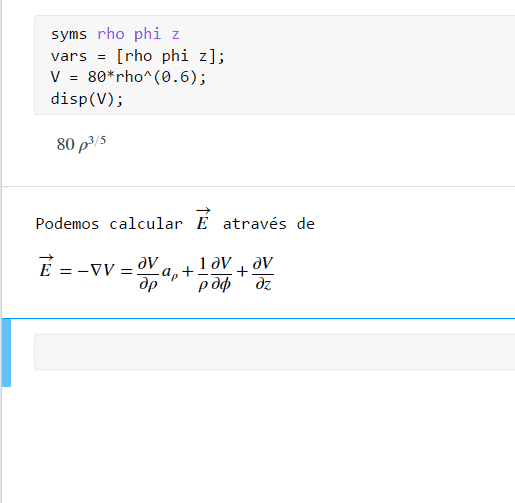

# sym∇
Funções MATLAB para calculo simbólico de divergente, gradiente e rotacional nos sistemas de coordenadas: 
* cartesianas (x, y, z)
* cilíndricas círculares (ρ, ϕ, z)
* esféricas (r, θ, ϕ)

## Motivação

O projeto foi motivado pela necessidade de realizar calculos simbolicos em coordenadas cilíndricas e esféricas, para resolução computacional de problemas propostos na disciplina de Eletromagnetismo na [UCP](http://ucp.br/).

## Veja em ação:
.gif com execução da função sym_gradient

Código executado no live editor do MATLAB R2018a.
